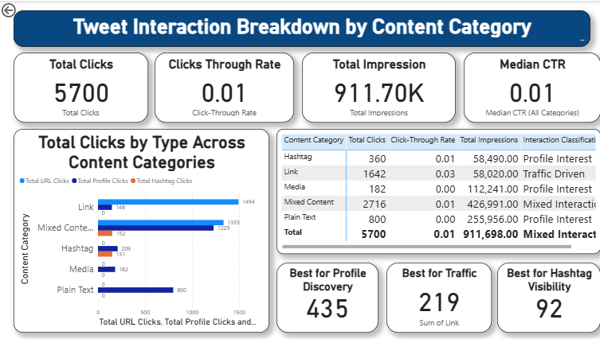
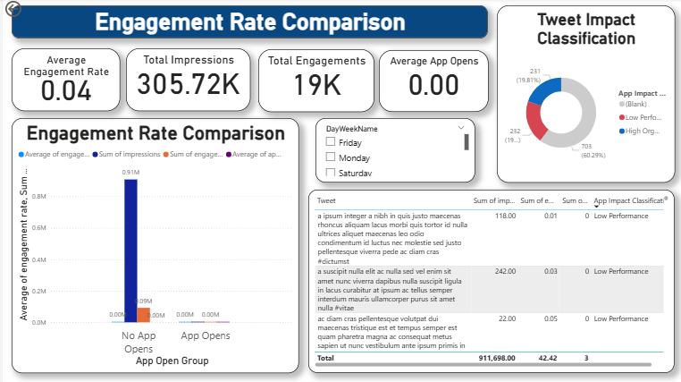
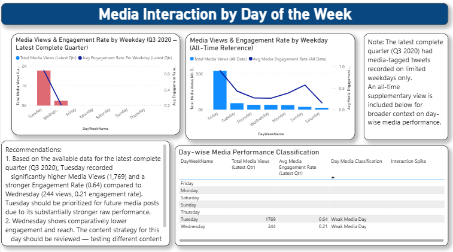
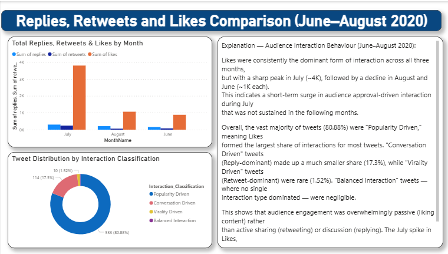
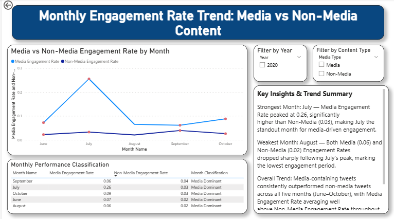
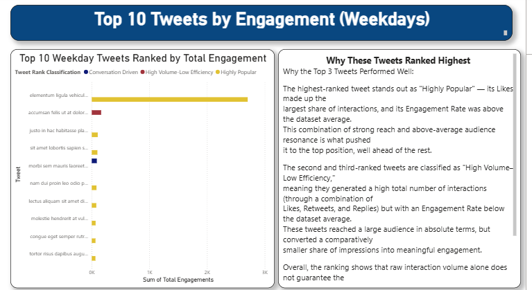

# Twitter Analytics Dashboard — Power BI Project

This is a Power BI project I built while working through a Twitter/social-media engagement dataset (1,181 tweets), as part of the "Learn to Build Real-Time Twitter Analytics Dashboard" program. It's split into six tasks — each one looks at the data from a different angle: content type, time of day, day of the week, month, and individual tweet performance.

## Dataset

`Tweet.xlsx` — tweet-level data with impressions, engagements, likes, retweets, replies, URL clicks, hashtag clicks, profile clicks, media views/engagements, app opens, and timestamps.

## What's in this repo

| File | What it is |

| `Twitter_Analysis_Dashboard.pbix` | The full Power BI file — all 6 tasks, one page each |
| `Tweet.xlsx` | The source dataset |
| `screenshots/` | A screenshot of each task's dashboard |
| `Twitter_Analytics_Project_Report.docx` | Full write-up — what each task asked for, how I built it, and what I found |

## Tools used

Power BI Desktop — Power Query for cleaning the data, DAX for the columns and measures, and Power BI's native visuals for everything else.

---

## Task 1 — Tweet Interaction Breakdown by Content Category

Grouped tweets into five categories — Media, Link, Hashtag, Mixed Content, or Plain Text — based on what's in each tweet. Since the tweet text here is placeholder text with no real links or media tags, I used the engagement columns as a stand-in (media views/engagements → media, URL clicks → link, hashtag clicks → hashtag). Any tweet with more than one of those got tagged Mixed Content so it wasn't counted twice. From there, compared URL Clicks, Profile Clicks and Hashtag Clicks across categories, and worked out which one is best for traffic, profile discovery, and hashtag visibility.

**What I found:** Link tweets bring in the most URL clicks (1,494) — best category for traffic. Mixed Content tweets get the most Profile Clicks (1,229) and Hashtag Clicks (152) — best for profile discovery and hashtag visibility.

## Task 2 — Engagement Rate Comparison

Compared tweets that led to an app open against ones that didn't, but only for tweets posted on a weekday between 9 AM and 5 PM. Classified each as High App Impact, App Interest–Low Engagement, High Organic Reach, or Low Performance.

**What I found:** None of the tweets with app opens actually landed inside that business-hours window — everything driving app opens happened outside 9-to-5. That's a scheduling gap worth fixing.

## Task 3 — Media Interaction by Day of the Week

Charted Media Views and Media Engagement Rate by weekday for the latest complete quarter in the data (worked out to be Q3 2020), and classified each day as Strong Media Day, High Reach–Low Interaction, Niche High-Quality Day, or Weak Media Day, flagging any day 20%+ above the weekday average as an Interaction Spike. Q3 2020 only had media-tagged tweets on two of the seven days, so I added a second all-time chart for a fuller picture.

**What I found:** Of the two days with media activity in Q3 2020, Tuesday came out well ahead — 1,769 views and a 0.64 engagement rate, against Wednesday's 244 views and 0.21.

## Task 4 — Replies, Retweets and Likes Comparison

Compared total Replies, Retweets and Likes by month for June–August 2020 (leaving out tweets with zero interactions), and classified each tweet by whichever interaction type made up the biggest share — Conversation Driven, Virality Driven, Popularity Driven, or Balanced Interaction — with a separate Low Interaction flag for anything below the median.

**What I found:** Likes spiked hard in July (~4K) then dropped back to around 1K in both June and August. About 81% of tweets were Popularity Driven (Likes lead), 17% Conversation Driven, and only 1.5% Virality Driven — most of the engagement here is people liking, not sharing or replying.

## Task 5 — Monthly Engagement Rate Trend

Built a monthly line chart comparing Media vs Non-Media Engagement Rate, using a proper Date table (built with `CALENDAR()`) with Year and Content Type filters. Each month gets classified as Media Dominant, Non-Media Dominant, Balanced, or Engagement Decline Alert — the alert overrides the usual classification if there are two consecutive months of decline.

**What I found:** July was the strongest month by far (Media Engagement Rate hit 0.26 against Non-Media's 0.03), and August was the weakest, with both rates dropping right after July's peak. Media beat Non-Media every month from June through October.

## Task 6 — Top 10 Tweets by Engagement

Ranked the top 10 weekday tweets by Total Engagements (Likes + Retweets + Replies), and classified each as Highly Shareable, Highly Popular, Conversation Driven, or High Volume–Low Efficiency, based on which interaction type dominates it relative to the dataset averages.

**What I found:** The top tweet is Highly Popular — mostly Likes, with an above-average engagement rate, so it's not just reach, it's resonance too. The next two are High Volume–Low Efficiency: plenty of interactions, but a below-average engagement rate — volume and quality aren't the same thing.

## Overall takeaway

A few things show up again and again across the six tasks. Media and link-based tweets consistently do better than plain text on engagement and click-through. Most of the audience's interaction is passive — liking rather than retweeting or replying. July shows up as a peak month more than once, followed by a drop in August each time. 

## Author

*(Urwashi Nimiwal / www.linkedin.com/in/urwashi-nimiwal)*
